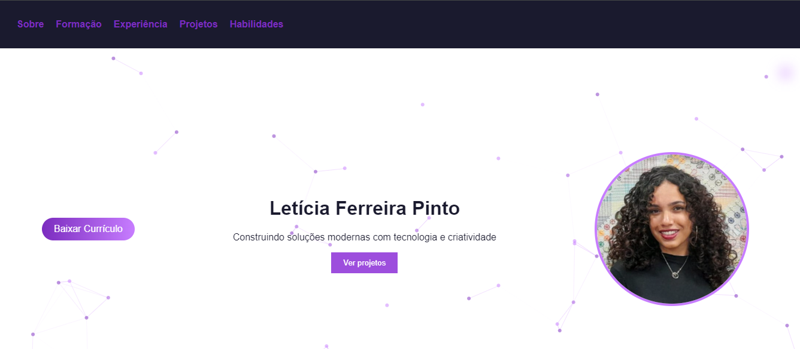

# 🌐 Personal Portfolio - Letícia Ferreira Pinto

This is my personal portfolio website, developed to showcase my projects, skills, and experience as a Full Stack Developer.

## 👩‍💻 About Me

I am a Software Engineering student with a technical background in IT, passionate about building modern web applications and continuously improving my skills.

## 🚀 Live Demo

👉 https://l3ticialele.github.io/portfolio-leticia/

---

## 🖥️ About the Project

This portfolio was designed and developed with a focus on:

* Clean and modern UI
* Smooth user experience
* Responsive design
* Interactive elements and animations

It represents not only my technical skills, but also my attention to design and usability.

---

## 🛠️ Technologies Used

* HTML5
* CSS3
* JavaScript
* Git & GitHub

---

## ✨ Features

* Animated sections on scroll
* Interactive navigation menu
* Responsive layout
* Skills with animated progress bars
* Projects showcase with descriptions
* Contact section with direct links

---

## 🎯 Purpose

This project aims to:

* Present my technical skills
* Showcase real projects
* Serve as a professional portfolio for job opportunities

---

## 📸 Preview

*(You can add screenshots of your portfolio here later)*

---

## 📬 Contact

* Email: [leticiaferreirapinto5@gmail.com](mailto:leticiaferreirapinto5gmail.com)
* LinkedIn: [linkedin/leticiaferreirapinto](https://www.linkedin.com/in/leticiaferreirapinto/)
* GitHub: [github/L3ticialele](https://github.com/L3ticialele)

---

## 📌 Author

**Letícia Ferreira Pinto**

---

## ⭐ Notes

This project is continuously being improved as I learn and grow as a developer.
